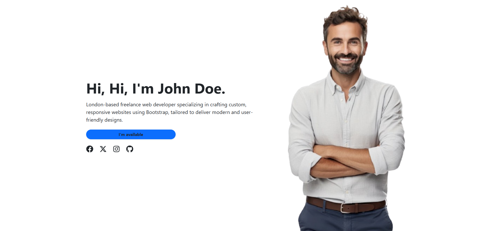

# React Bootstrap Hero Section

[](https://opensource.org/licenses/MIT)
[](https://vitejs.dev/)
[](https://reactjs.org/)
[](https://getbootstrap.com/)

A **responsive static Hero Section** built with **React**, **Bootstrap 5**, and powered by **Vite** for fast builds and development.  
This project includes **two modular components** — `Information` and `Image` — which together create a clean, professional, and mobile-first landing section.

---

## Table of Contents

- [Features](#features)
- [Screenshots](#screenshots)
- [Tech Stack](#tech-stack)
- [Folder Structure](#folder-structure)
- [Installation](#installation)
- [Usage](#usage)
  - [Information Component](#information-component)
  - [Image Component](#image-component)
- [Contributing](#contributing)
- [License](#license)

---

## Features

- 🎨 **Responsive Layout**: Built with **Bootstrap 5 grid system**, fully mobile-first.
- ⚡ **Vite-Powered**: Lightning-fast hot reloading and optimized builds.
- 🧩 **Modular Components**: `Information` and `Image` for easy customization.
- 🖼 **Hero Section Design**: Clean, professional landing section ready to integrate into any project.
- 🌐 **Cross-Browser Compatibility**: Works on all modern browsers and devices.

---

## Preview



---

## Tech Stack

| Technology | Version | Purpose                        |
| ---------- | ------- | ------------------------------ |
| Vite       | 7.0.4   | Fast build tool & dev server   |
| React      | 19.1.0  | Front-end library              |
| Bootstrap  | 5.3.7   | Responsive layout & components |

---

## Folder Structure

```bash
bootstrap-ui/
├── public/               # Static assets (e.g., favicon)
├── src/
│   ├── assets/           # Images and static resources
│   ├── components/       # Modular React components
│   │   ├── Information.jsx
│   │   └── Image.jsx
│   ├── App.jsx           # Main app component
│   ├── main.jsx          # React entry point
├── index.html            # Base HTML file for Vite
├── package.json          # Project metadata & dependencies
├── vite.config.js        # Vite configuration
└── README.md             # Project documentation
```

## Installation

1. **Clone the repository**

```bash
git clone https://github.com/your-username/bootstrap-ui.git
cd bootstrap-ui
```

2. **Install dependencies**

```bash
npm install
```

3. **Start the development server**

```bash
npm run dev
```

4. **Open your browser and visit**

```bash
http://localhost:5173
```

## Usage

This project contains **two key components** inside `src/components` that make up the **Hero Section**.

### Information Component

- Displays **headline text, description, and a CTA button**.
- Uses **Bootstrap typography and utility classes** for styling.
- Can be easily customized by editing `Information.jsx`.

### Image Component

- Displays a **responsive image** aligned to the **bottom or center**.
- Uses **Bootstrap’s `img-fluid`** for proper scaling.
- Customize the **image source and styling** in `Image.jsx`.
